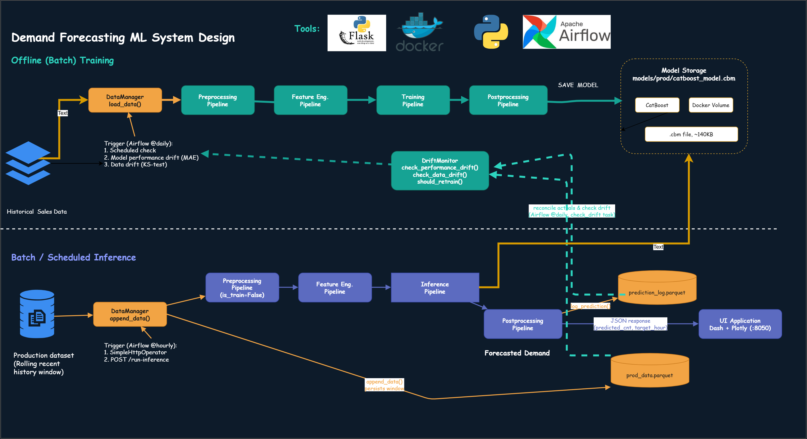
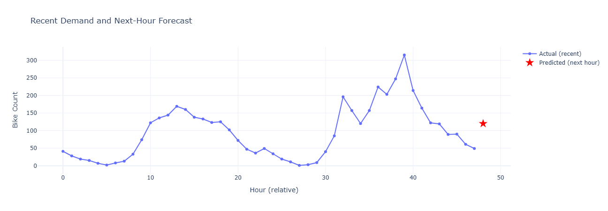
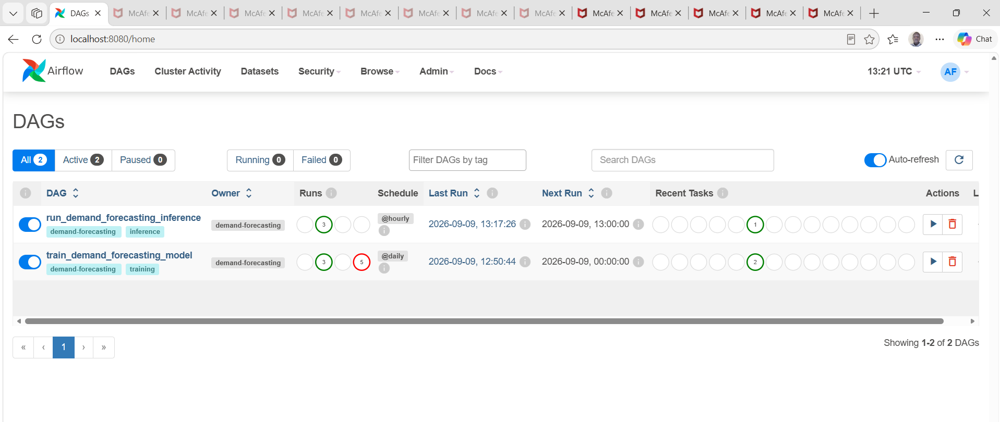
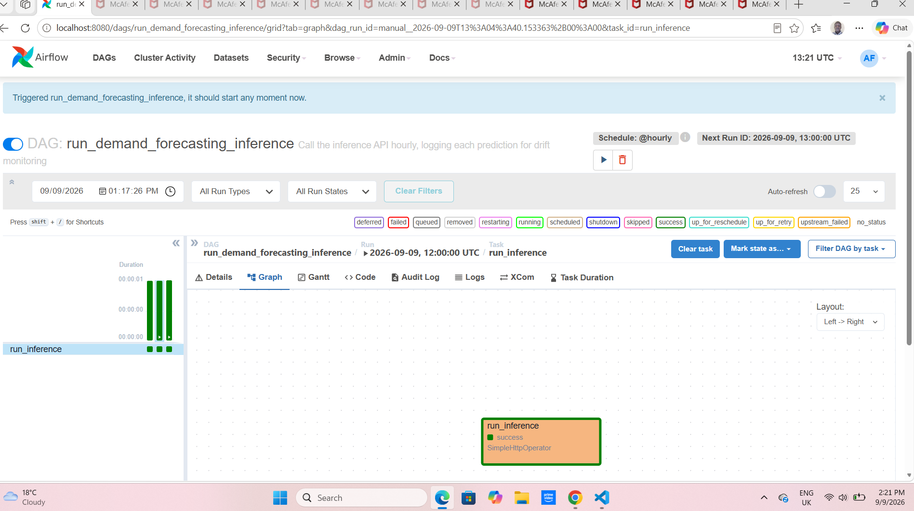
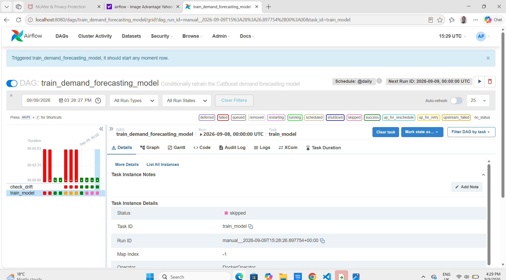

# Demand-Forecasting

## Purpose
This system forecasts next-hour bike-share demand from historical usage and weather data, and serves that forecast through a live API and dashboard. Raw hourly rental data is explored and modelled in notebooks, then the winning approach — CatBoost with lag-based feature engineering, tuned offline via Optuna — is translated into five modular, config-driven pipeline classes. Those classes are shared by two independent code paths: a training job that fits and saves the model, and an inference service that predicts the next hour's demand from a rolling window of recent data. A Dash dashboard sits on top of the inference API for interactive use, and Apache Airflow orchestrates the whole system end to end — logging every prediction, checking model performance and input-data drift against the training baseline, and retraining automatically only when the evidence says it's warranted, rather than on a blind fixed schedule.

## Architecture



## Data Flow
1. **Notebook exploration:** `EDA.ipynb` profiles the raw hourly rental data (seasonality, weather effects, the working-day/weekend split in the hourly demand curve); `Modeling.ipynb` establishes a dummy baseline, shows that lag features are what actually move performance, and tunes the final CatBoost model with Optuna.
2. **Modularisation:** the notebook logic is translated into five pipeline classes under `app-ml/src/pipelines/`, each satisfying a fixed contract so `PipelineRunner` can compose them for either training or inference without knowing their internals.
3. **Training:** `app-ml/entrypoint/train.py` loads raw data, runs the full pipeline, and saves a `.cbm` model to `models/prod/`.
4. **Inference:** `app-ml/entrypoint/inference_api.py` exposes `POST /run-inference` — it assembles a historical window via `DataManager.append_data`, runs the same preprocessing/feature-engineering logic in inference mode, predicts the next hour, and logs the prediction for drift monitoring.
5. **Serving:** `app-ui/app.py`, a Dash app, calls the inference API and plots recent demand alongside the new forecast.
6. **Orchestration:** two Airflow DAGs run independently — one calls the inference API hourly (accumulating a prediction history), the other checks performance and data drift daily and conditionally retrains.

## Technologies Used
- **Python 3.11** — two isolated conda environments (`app-ml`, `app-ui`), mirroring the eventual container boundary.
- **CatBoost** — gradient boosting model; hyperparameters tuned offline with **Optuna** and baked into config, not re-tuned on every training run.
- **pandas / pyarrow** — data handling; production data is stored as Parquet.
- **scikit-learn / scipy** — evaluation metrics and the Kolmogorov–Smirnov test used for data-drift detection.
- **Flask** — the inference API.
- **Dash + Plotly** — the interactive dashboard, served in production via **gunicorn**.
- **Docker / Docker Compose** — every service (training, inference API, UI, Airflow) runs as an isolated, independently buildable container.
- **Apache Airflow** (`LocalExecutor`) — schedules inference and gates retraining behind a drift check; controls sibling Docker containers via `DockerOperator` over the host's Docker socket.
- **PostgreSQL** — Airflow's metadata database.

## Pipeline Contract

`PipelineRunner` composes the five classes below without inspecting their internals — each one only has to satisfy the input/output shape in this table.

| Class | Called as | Returns | Responsibility |
| --- | --- | --- | --- |
| `PreprocessingPipeline` | `.run(df, is_train)` | `pd.DataFrame` | Drops irrelevant columns; creates the shifted `target` column, but only when `is_train=True` — inference has no future value to shift from. |
| `FeatureEngineeringPipeline` | `.run(df)` | `pd.DataFrame` | Adds target lags (1, 2, 22, 23 — chosen from autocorrelation, capturing daily seasonality) and short lags on `hr`, `weekday`, `weathersit`, `temp`, `hum`. |
| `TrainingPipeline` | `.run(df)` | fitted model | Fits CatBoost with fixed, pre-tuned hyperparameters from config — no search happens in production. |
| `PostprocessingPipeline` | `.run_train(model)` / `.run_inference(y_pred)` | `None` / `pd.DataFrame` | Saves the model to disk; wraps a raw prediction into a rounded, non-negative, timestamped result. |
| `InferencePipeline` | `.run(x)` | `float` | Lazily loads the saved model on first use, predicts on the most recent row of a supplied window. |

## Pipeline Implementation

### Preprocessing — train/inference asymmetry
The same method serves both flows, but only training needs a label:

```python
class PreprocessingPipeline:
    def __init__(self, config):
        self.config = config
        self.drop_cols = config['preprocessing']['drop_cols']

    def run(self, df: pd.DataFrame, is_train: bool = True) -> pd.DataFrame:
        df = df.copy()
        if is_train:
            df['target'] = df['cnt'].shift(-1).ffill()

        cols_to_drop = [c for c in self.drop_cols if c in df.columns]
        return df.drop(columns=cols_to_drop)
```

`cnt` (current-hour count) is deliberately *not* in `drop_cols` — it's a legitimate feature for forecasting the next hour, unlike `casual`/`registered`, which leak directly into the target.

### Feature engineering — lags justified by autocorrelation
```python
class FeatureEngineeringPipeline:
    def run(self, df: pd.DataFrame) -> pd.DataFrame:
        df = df.copy()
        for lag in self.target_lags:                # [1, 2, 22, 23]
            df[f'{self.target_lag_col}_lag_{lag}'] = (
                df[self.target_lag_col].shift(lag).bfill()
            )
        for feat in self.lag_features:               # hr, weekday, weathersit, temp, hum
            for lag in range(1, self.n_feature_lags + 1):
                df[f'{feat}_lag_{lag}'] = df[feat].shift(lag).bfill()
        return df
```
The 1–2 and 22–23 hour lags on the target aren't arbitrary — they came directly from computing `target.autocorr(lag)` across 24 hours in the notebook and reading off where correlation peaked.

### Drift monitoring — performance and data, combined
```python
class DriftMonitor:
    def check_performance_drift(self) -> bool:
        reconciled = self._reconciled_log()
        if len(reconciled) < self.perf_cfg['min_samples']:
            return False
        recent = reconciled.tail(self.perf_cfg['min_samples'])
        mae = np.mean(np.abs(recent['actual_cnt'] - recent['predicted_cnt']))
        return mae > self.perf_cfg['threshold']

    def check_data_drift(self, raw_data_path, prod_data_path) -> bool:
        baseline = pd.read_parquet(raw_data_path)
        recent = pd.read_parquet(prod_data_path).tail(self.drift_cfg['window_hours'])
        for feature in self.drift_cfg['features']:
            _, p_value = ks_2samp(baseline[feature], recent[feature])
            if p_value < self.drift_cfg['p_value_threshold']:
                return True
        return False

    def should_retrain(self, raw_data_path, prod_data_path) -> bool:
        return (
            self.check_performance_drift()
            or self.check_data_drift(raw_data_path, prod_data_path)
        )
```
Performance drift is the trustworthy, lagging signal — it only fires once enough predictions have been reconciled against real outcomes. Data drift is a leading indicator, catching a shift in incoming conditions before it necessarily shows up in prediction error. Either one is sufficient reason to retrain.

## Orchestration — two independent DAGs

**`run_demand_forecasting_inference`** (`@hourly`) — calls the already-running inference API over HTTP rather than spinning up a new container, since the model is already loaded in memory:
```python
run_inference = SimpleHttpOperator(
    task_id="run_inference",
    http_conn_id="inference_api",
    endpoint="/run-inference",
    method="POST",
)
```

**`train_demand_forecasting_model`** (`@daily`) — a `ShortCircuitOperator` gates training behind the drift decision, so a healthy model is correctly *skipped*, not retrained on a blind timer:
```python
check_drift_task = ShortCircuitOperator(
    task_id="check_drift",
    python_callable=check_drift,   # reconciles the log, then calls should_retrain()
)

train_model = DockerOperator(
    task_id="train_model",
    image="demand-forecasting-ml",
    command="python app-ml/entrypoint/train.py",
    docker_url="unix://var/run/docker.sock",
    mounts=[...],  # data/ and models/, bind-mounted from the host
)

check_drift_task >> train_model
```
When `check_drift` returns `False`, Airflow marks `train_model` as **skipped**, not failed — "nothing's wrong" is a distinct, correctly-represented outcome, not an error state.

## Dashboard
The Dash UI plots the last 48 hours of actual demand alongside the freshly predicted next hour, styled as a distinct marker on the same axis. It calls the inference API's real HTTP endpoint — inside Docker Compose, via the container's service name (`app-ml-inference-api`) resolved through Compose's internal DNS, not `localhost`.



## Orchestration in Action

Both DAGs registered, unpaused, and running on their own schedules — `run_demand_forecasting_inference` hourly, `train_demand_forecasting_model` daily:



**Inference DAG** — a single `SimpleHttpOperator` task calling the live API:



**Training DAG** — `check_drift` (`ShortCircuitOperator`) gates `train_model` (`DockerOperator`). The task detail panel below shows `train_model` with **`Status: skipped`**, not `success` — proof the model was healthy at this run and training correctly did *not* fire, rather than retraining blindly on every scheduled tick. The mixed red/green history in the run grid on the left reflects earlier infrastructure debugging (Docker socket permissions, a module-import ordering bug) rather than the drift logic itself, which has run correctly since:



## Repository Structure
```
demand-forecasting/
├── app-ml/
│   ├── entrypoint/
│   │   ├── train.py                 # Standalone training job
│   │   ├── inference.py             # One-shot inference (CLI/testing)
│   │   └── inference_api.py         # Flask API, logs predictions for drift monitoring
│   ├── notebooks/
│   │   ├── EDA.ipynb
│   │   └── Modeling.ipynb
│   ├── src/pipelines/
│   │   ├── preprocessing.py
│   │   ├── feature_engineering.py
│   │   ├── training.py
│   │   ├── inference.py
│   │   ├── postprocessing.py
│   │   └── pipeline_runner.py
│   ├── requirements.txt
│   ├── requirements-dev.txt         # Notebook/tuning-only deps, excluded from the image
│   └── Dockerfile
├── app-ui/
│   ├── app.py
│   ├── requirements.txt
│   └── Dockerfile
├── common/
│   ├── data_manager.py              # Load/save/append — assembles inference windows
│   ├── monitoring.py                # DriftMonitor
│   └── utils.py
├── airflow/
│   ├── Dockerfile                   # Bakes in the Docker provider — no runtime reinstall
│   └── dags/
│       ├── train_dag.py
│       └── inference_dag.py
├── config/
│   └── config.yaml                  # Every pipeline parameter, in one place
├── data/
│   ├── raw_data/                    # Training baseline (git-ignored)
│   └── prod_data/                   # Accumulated "live" data + prediction log (git-ignored)
├── models/
│   ├── experiments/                 # Notebook-trained models
│   └── prod/                        # Production model, written by train.py
├── docker-compose.yml               # All seven services: 3 app + 4 Airflow
└── environment.yml
```

## Development Setup

**Environments** (separate on purpose — mirrors the eventual container boundary):
```bash
conda env create -f environment.yml -n demand-forecasting-ml
conda activate demand-forecasting-ml
pip install -r app-ml/requirements.txt

conda env create -f environment.yml -n demand-forecasting-ui
conda activate demand-forecasting-ui
pip install -r app-ui/requirements.txt
```

**Notebooks:** run `EDA.ipynb`, then `Modeling.ipynb`, end to end. `Modeling.ipynb`'s Optuna search produces the hyperparameters that belong in `config.yaml`'s `training.model_params`.

**Full stack:**
```bash
docker compose up --build
```
Brings up all seven services: `app-ml-train` (one-shot), `app-ml-inference-api` (`:5001`), `app-ui` (`:8050`), and the full Airflow deployment (`:8080`, `admin`/`admin` for local dev — change before any non-local deployment).

**Airflow first-run setup:** add an HTTP Connection (`Admin → Connections`) named `inference_api`, host `app-ml-inference-api`, port `5001` — this is what `inference_dag.py` calls.

## Design Notes
- **Config-driven, not hardcoded.** Drop columns, lag windows, model hyperparameters, and drift thresholds all live in `config.yaml`. Changing behaviour means editing YAML, not Python.
- **Tune offline, retrain with fixed parameters.** Optuna's search lives only in the notebook. Production training fits a fixed-hyperparameter model fast and deterministically; retuning is a separate, occasional, human-triggered step — not something that happens on every scheduled run.
- **Lazy model loading.** `InferencePipeline` only loads the `.cbm` file on first actual use, not at construction — otherwise `PipelineRunner`'s eager instantiation of all five classes would fail before a model even exists, on the very first training run.
- **Root only where it's actually needed.** Of the four Airflow containers, only the scheduler touches `/var/run/docker.sock` (via `LocalExecutor`, which runs `DockerOperator` tasks from the scheduler process) — it's the only one that runs as root or has the socket mounted.
- **A custom Airflow image, not runtime pip installs.** `_PIP_ADDITIONAL_REQUIREMENTS` reinstalling the Docker provider on every container start proved fragile enough to cause real crash loops under load. Baking it into a custom image at build time removed the failure mode entirely.
- **Two drift signals, not one.** Performance drift is trustworthy but lagging — it needs reconciled outcomes, which take time to accumulate. Data drift is faster to detect but noisier. Checking both, and retraining if either fires, covers more failure modes than either alone.
- **Drift checks need clean, representative input.** Early testing fed `check_data_drift` a scattered, non-continuous sample assembled from many different manual tests — the KS-test correctly flagged it as different from the training baseline, but for the wrong reason (test contamination, not real drift). The fix was resetting the production data file, not changing the detection logic.